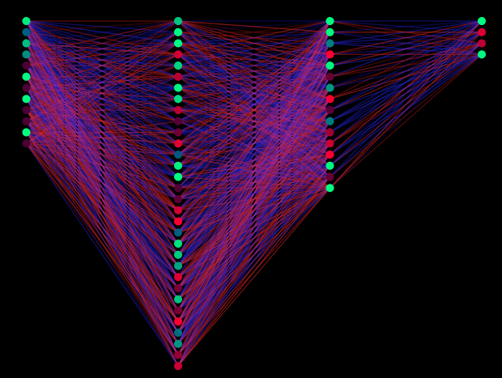

# 🐍 Snake AI: Эволюция нейросети на Rust

Проект по созданию самообучающегося искусственного интеллекта для игры в «Змейку». ИИ обучается «с нуля» с помощью **нейросети прямого распространения** и **генетического алгоритма**.

---

## 📺 Визуализация

Окно приложения разделено на две зоны:
1.  **Игровое поле (слева):** Процесс обучения текущего поколения.
2.  **Мозг чемпиона (справа):** Визуализация нейронных связей лучшей змейки предыдущего поколения.
    * **Линии:** Веса связей (Синие — положительные, Красные — отрицательные).
    * **Узлы:** Нейроны (Яркость зависит от текущей активации).





---

## 🧠 Техническая реализация

### 1. Архитектура нейросети
Используется многослойный перцептрон (MLP):
* **Входной слой (12):** Расстояния до стен, датчики направления еды и детекторы препятствий.
* **Скрытые слои (32, 16):** Используют функцию активации `tanh` для внесения нелинейности.
* **Выходной слой (4):** Команды движения (Вверх, Вниз, Влево, Вправо).

### 2. Генетический алгоритм
Эволюция происходит по следующим правилам:
* **Selection (Отбор):** Змейки сортируются по показателю `fitness`.
* **Elitism (Элитизм):** 2 лучшие особи переходят в новое поколение без изменений.
* **Mutation (Мутация):** Остальные 498 особей создаются путем клонирования лидеров с 10% шансом изменения каждого веса.

### 3. Функция приспособленности (Fitness)
Алгоритм поощряет эффективное поведение:
* **Бонус за еду:** `score * score * 500` (экспоненциальный рост за каждое яблоко).
* **Бонус за жизнь:** `lifetime * 0.01` (поощрение долгого выживания).
* **Штраф:** `-100`, если змейка погибает мгновенно, не собрав еды.

---

## ⚙️ Конфигурация
Все ключевые параметры вынесены в модуль `src/config.rs` для удобства экспериментов:

| Параметр | Описание                   | Значение |
| :--- |:---------------------------| :--- |
| `POPULATION_SIZE` | Размер популяции           | `500` |
| `MUTATION_RATE` | Шанс мутации веса          | `0.1` |
| `GRID_SIZE` | Размер поля (клеток)       | `20` |
| `UPS` | Скорость обновления экрана | `200` |

---

## 🚀 Запуск проекта

### Предварительные требования
* Установленный [Rust & Cargo](https://rustup.rs/)
* Графический драйвер с поддержкой OpenGL 3.2

### Команды
```bash
# Клонировать репозиторий
git clone [https://github.com/your-username/snake-ai-rust](https://github.com/your-username/snake-ai-rust)

# Перейти в папку проекта
cd snake-ai-rust

# Запустить обучение (в режиме release для скорости)
cargo run --release